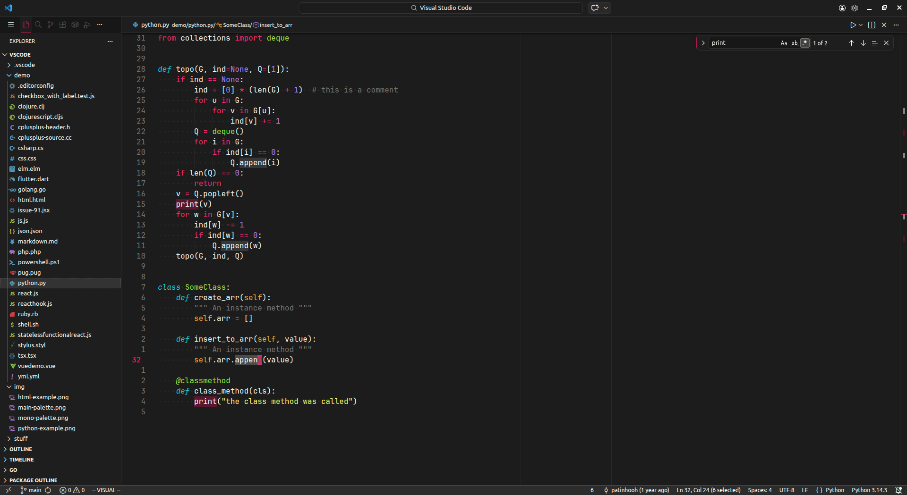
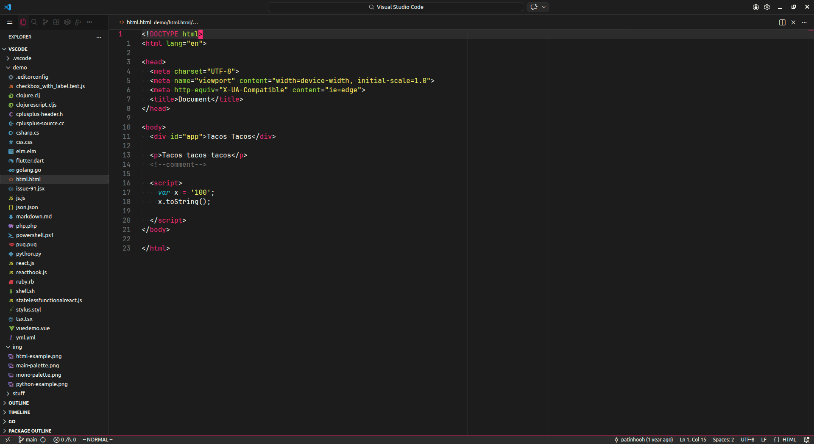
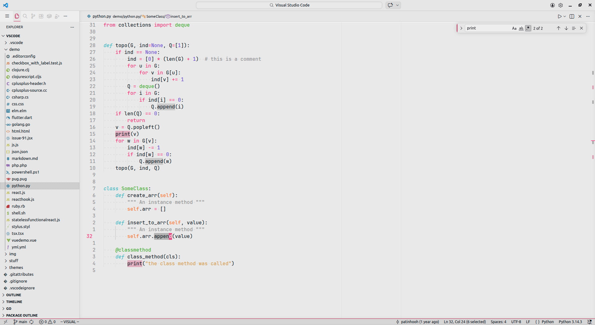
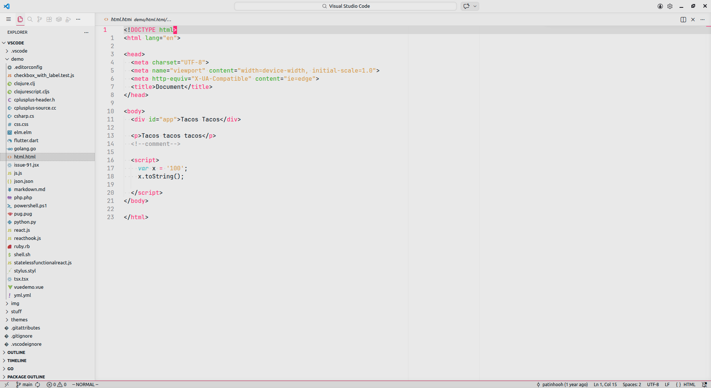
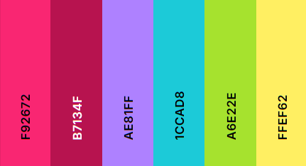
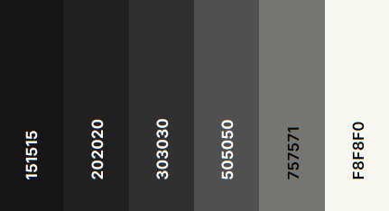

# Patinhooh's Theme

## Overview

Crafted because nothing out there matched my style. It's sharp, vibrant, and exactly what I needed. If you're looking for a theme that strikes a perfect balance between vibrancy and clarity, this theme might be exactly what you've been searching for.

**Enjoy the Theme!**

  
  
  
  

 

## Languages Tailored So Far

- Python
- C
- C++
- Golang
- JavaScript
- JSON
- TOML
- Markdown
- HTML

If you use a different language and something doesn’t look right, it’s probably because it hasn’t been customized yet. The theme is open source, so feel free to contribute improvements for your language!

 

## Color Palette

- **Main Palette:**

- **Monochromatic Palette:**

> check full palettes in the [palette-dark.txt](palettes/palette-dark.txt) and [palette-light.txt](palettes/palette-light.txt).

 

## Inspirations

The creation of my theme drew significant inspiration from the following:

- **[Monokai](https://github.com/microsoft/vscode/tree/main/extensions/theme-monokai)**: This theme served as the starting point for the palette. It was my go-to theme before I decided to craft my own.
- **[Night Owl](https://github.com/sdras/night-owl-vscode-theme/)**: Provided valuable examples for syntax highlighting and offered insightful guidance during the early stages of development.
- **[Gruber Darker](https://github.com/rexim/gruber-darker-theme)**: Helped dial down the chaos. It pushed me to remove colors and aim for clarity.

 

## Helpfull Resources To Create Your Own Theme

- [Theme Creator](https://themes.vscode.one/edit/local/)
- [VS Code Get Started Themes](https://code.visualstudio.com/docs/getstarted/themes)
- [VS Code Theme Color](https://code.visualstudio.com/api/references/theme-color)
- [VS Code UX Guidelines](https://code.visualstudio.com/api/ux-guidelines/overview)
